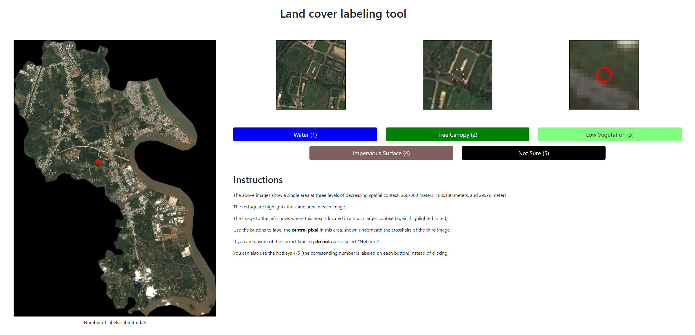

# Satellite imagery label tool

This tool provides an easy way to collect a random sample of labels over a given scene of satellite imagery.

Run as: `python server.py --input_fn path/to/imagery.tif --output_fn labels.csv`, where "imagery.tif" is a GeoTIFF (or any other format that GDAL can read) with 3 bands of Byte type data (preferably RGB bands), and "labels.csv" is the file where the output will be written. 

This command will start an HTTP server on a given port (defaults to 4042). Users that visit the host the server is running on will be shown a web page like the one below. On this page they will be sequentially presented a patch of imagery sampled from "imagery.tif" at 3 different zoom levels and asked to label the central pixel. The same patch will be shown multiple times while the server is running so class agreement between users can be calculated.

## TODO:
- Allow user to easily customize the class list (config file that is rendered to index.html by the server)
- Allow user to pass a list of rasters to be used in the tool instead of just 1
- Allow user to easily include class descriptions and examples (config file that is rendered to index.html by the server)